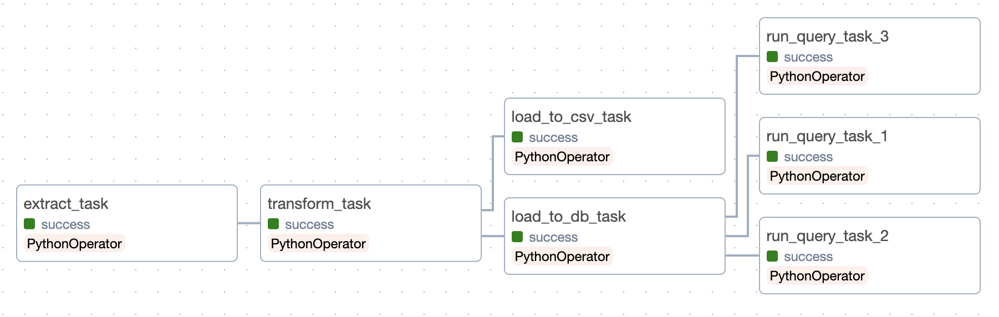

# Banks MC ETL Pipeline
This project aims to simulate a live data streaming pipeline for collecting, transforming, and storing data. It leverages Python, Airflow, PostgreSQL, Kafka, Spark, and Cassandra to create an end-to-end solution. Docker is employed to containerize everything, ensuring consistency and simplified deployment.

  

## ETL Operations
- Extract: [randomuser.me](https://randomuser.me/) API serves as the source of raw data
- Transform: Python is employed for transforming raw data into the required format
- Load:

## Tools & Libraries
- Python
- Airflow
- Request, BeautifulSoup, Pandas, Numpy
